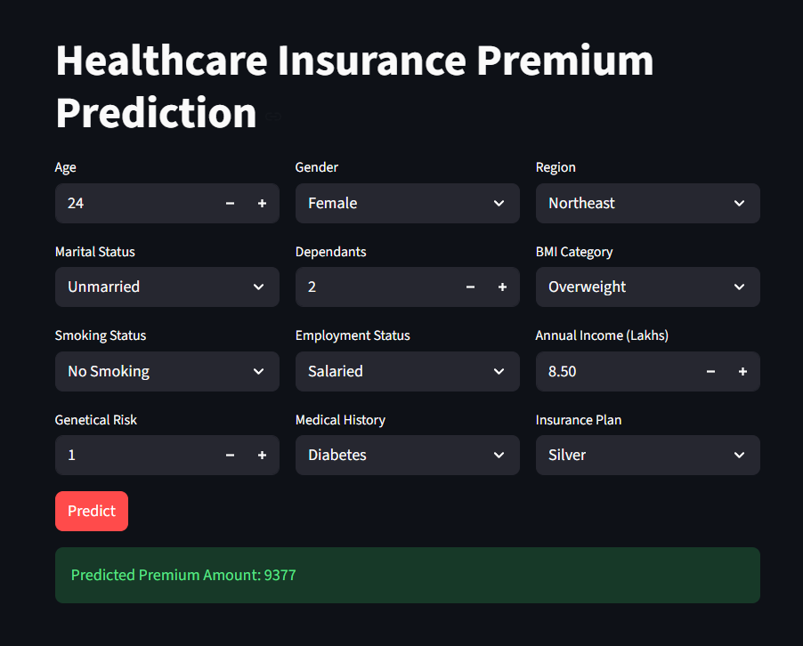

# 🏥 Healthcare Insurance Premium Prediction

An end-to-end Machine Learning application that predicts an individual's annual healthcare insurance premium based on demographic, lifestyle, financial, and medical information.

The project demonstrates the complete Data Science lifecycle—from data preprocessing and feature engineering to model training, evaluation, and deployment using **Streamlit**.

---

## 🚀 Live Demo

🔗 **Application:** [Healthcare Insurance Premium Predictor](https://healthcare-premium-prediction-4nshhh.streamlit.app/)

---

## 📌 Project Overview

Insurance companies determine premium amounts using numerous risk factors such as age, medical history, smoking habits, income, and lifestyle. Estimating premiums accurately is crucial for balancing customer affordability with business risk.

This project leverages Machine Learning to predict healthcare insurance premiums while incorporating domain-specific feature engineering and age-specific predictive models for improved accuracy.

---

## ✨ Features

- 📊 Predict annual healthcare insurance premium instantly
- 🧑 Interactive Streamlit dashboard
- 🧠 Age-based model selection
- ⚙️ Automated preprocessing pipeline
- 📈 Medical risk score generation
- 🔄 Feature scaling based on age group
- 🏥 Disease-based risk estimation
- 💻 Responsive and user-friendly interface

---

# 🖥️ Application Preview



---

# 📊 Input Features

The model predicts insurance premium using:

| Feature | Description |
|----------|-------------|
| Age | Applicant's age |
| Gender | Male/Female |
| Region | Residential region |
| Marital Status | Married/Unmarried |
| Number of Dependants | Total dependants |
| BMI Category | Underweight, Normal, Overweight, Obesity |
| Smoking Status | No Smoking, Occasional, Regular |
| Employment Status | Salaried, Self-Employed, Freelancer |
| Annual Income | Income in Lakhs |
| Genetical Risk | Genetic risk score |
| Medical History | Existing diseases |
| Insurance Plan | Bronze, Silver, Gold |

---

# ⚙️ Machine Learning Workflow

```
Raw Dataset
      │
      ▼
Data Cleaning
      │
      ▼
Feature Engineering
      │
      ▼
Medical Risk Score Generation
      │
      ▼
Encoding
      │
      ▼
Feature Scaling
      │
      ▼
Train/Test Split
      │
      ▼
Model Training
      │
      ▼
Model Evaluation
      │
      ▼
Streamlit Deployment
```

---

# 🧠 Feature Engineering

This project includes several custom engineered features to improve prediction performance:

- Normalized Medical Risk Score
- Disease Risk Score Calculation
- One-Hot Encoding
- Insurance Plan Ordinal Encoding
- Age-based Feature Scaling
- Separate preprocessing pipelines for different age groups

---

# 🤖 Model Architecture

Instead of using a single model for all users, this project employs **two specialized regression models**.

### Model 1
- Designed for applicants **≤ 25 years**

### Model 2
- Designed for applicants **> 25 years**

The application automatically selects the appropriate model during prediction.

---

# 📈 Technologies Used

### Programming

- Python

### Data Analysis

- Pandas
- NumPy

### Machine Learning

- Scikit-learn
- XGBoost
- Joblib

### Visualization

- Matplotlib
- Seaborn

### Deployment

- Streamlit

---

# 📂 Project Structure

```
Healthcare-Premium-Prediction/
│
├── app/
│   ├── artifacts/
│   │   ├── model_rest.joblib
│   │   ├── model_young.joblib
│   │   ├── scaler_rest.joblib
│   │   └── scaler_young.joblib
│   │
│   ├── main.py
│   └── prediction_helper.py
│
├── notebooks/
│   ├── file_seperation.ipynb
│   ├── ml_premium_prediction_rest_with_gr.ipynb
│   ├── ml_premium_prediction_rest.ipynb
│   ├── ml_premium_prediction_young_with_gr.ipynb
│   ├── ml_premium_prediction_young.ipynb
│   └── ml_premium_prediction.ipynb
│   
├── requirements.txt
├── LICENSE
└── README.md
```

---

# 🚀 Installation

Clone the repository

```bash
git clone https://github.com/4nshhh/healthcare-premium-prediction.git
```

Move into the project directory

```bash
cd healthcare-premium-prediction
```

Install dependencies

```bash
pip install -r requirements.txt
```

Run the application

```bash
streamlit run app/main.py
```

---

# 💡 Key Learnings

Through this project, I gained hands-on experience with:

- Data Cleaning
- Exploratory Data Analysis
- Feature Engineering
- Feature Scaling
- Machine Learning Pipelines
- Regression Models
- Model Deployment
- Streamlit
- Git & GitHub

---

# 🔮 Future Improvements

- SHAP Explainability
- Batch CSV Prediction
- Docker Support
- FastAPI Backend
- Cloud Deployment
- Model Monitoring

---

# 👨‍💻 Author

**Ansh Panchal**

Aspiring Data Scientist passionate about Machine Learning, Data Science, and Artificial Intelligence.

🔗 [LinkedIn](https://www.linkedin.com/in/4nshh/)  
💻 [GitHub](https://github.com/4nshh)  

---

## ⭐ If you found this project helpful, consider giving it a star!
